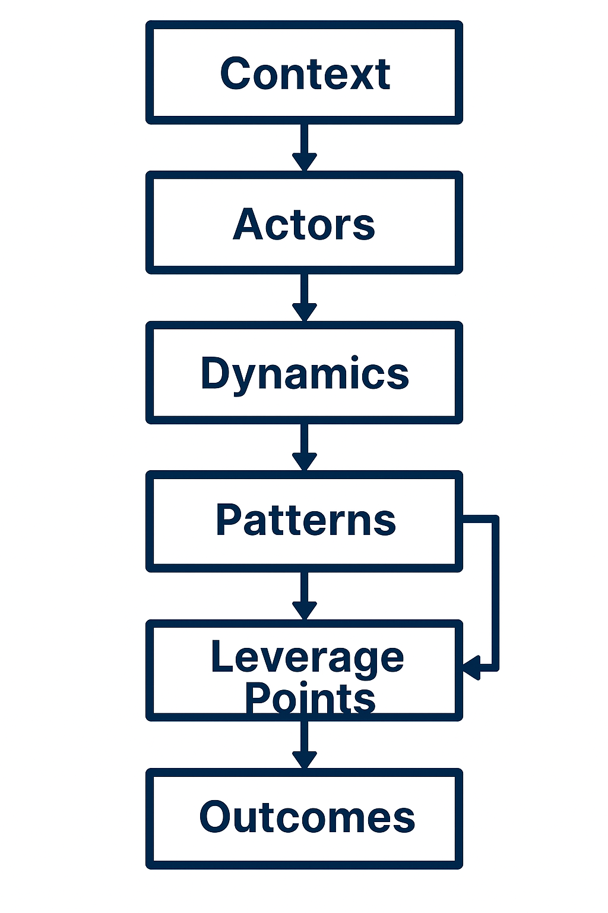

# UAPM Flow Diagram

This diagram illustrates the core structure of UAPM (Universal Analytical Pattern Method). It shows how each module connects to the next, forming a flexible framework for structured thinking and strategic insight.

---

## 🔷 Diagram

---

## 🧠 How to Read It

- **Context** sets the stage — the environment or situation being analyzed  
- **Actors** are the key individuals, forces, or entities involved  
- **Dynamics** describe the interactions and tensions between actors  
- **Patterns** emerge from those dynamics — recurring structures or behaviors  
- **Leverage Points** are strategic spots where small changes can create big impact  
- **Outcomes** are the potential results or scenarios that follow

---

## 🧩 Optional Layers

These can be applied across the entire framework:

- **Narrative Layer** – Adds storytelling or thematic framing  
- **Temporal Axis** – Tracks change over time  
- **Ethical Lens** – Evaluates moral dimensions of decisions or systems

---

## 💡 Notes

UAPM is modular and adaptable. The diagram is not a rigid flowchart — it’s a conceptual map. Use it to guide analysis, spark insight, and structure complex thinking.

